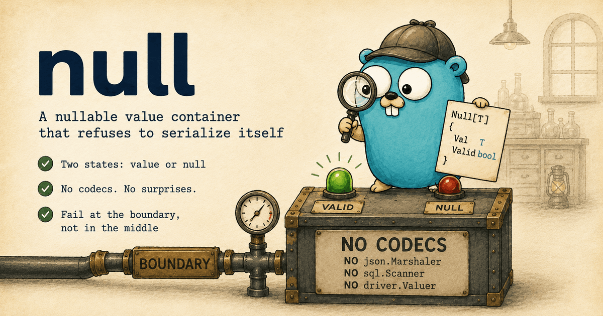

# `null`: a nullable value container that refuses to serialize itself

[](https://github.com/gokern/null/actions/workflows/ci.yml)
[](https://github.com/gokern/null/actions/workflows/lint.yml)
[](https://github.com/gokern/null/actions/workflows/codeql.yml)
[](https://pkg.go.dev/github.com/gokern/null)
[](go.mod)
[](https://github.com/gokern/null/releases)
[](LICENSE)

<p align="center">
  
</p>

`null.Null[T]` is a two-state value container: `{Val T; Valid bool}`, an
`IsZero` method, and no codecs. It implements neither
`json.Marshaler`/`Unmarshaler` nor `sql.Scanner`/`driver.Valuer`, and that
absence is the feature, not a gap. In a codebase that converts values at its
boundaries explicitly, a self-serializing container is a hole in the wall; a
codec-free one makes a skipped conversion fail at the boundary instead of
slipping through.

## Install

```sh
go get github.com/gokern/null
```

Requires Go 1.24+.

## Example

```go
type Update struct {
    Note   null.Null[string]
    Amount null.Null[int64]
}

n := null.From("hello")      // set
var empty null.Null[int]     // the zero value is null

n.Valid                      // true
n.Or("fallback")             // "hello"
null.From(1) == null.From(1) // true: value semantics, == just works
```

Boundary conversions are one-liners:

```go
// HTTP edge (ogen-style wrappers)
resp.Note.SetTo(v.Note.Val)       // when v.Note.Valid
dto.Note = null.FromPtr(req.Note) // pointer-shaped inputs

// DB edge (pgx)
pgtype.Text{String: n.Val, Valid: n.Valid}
```

## Why this exists

Every optional-value approach in Go has a documented failure mode.

`*T` pointers, the ecosystem default (Kubernetes, AWS SDK, Stripe), alias on
copy, panic on nil, and compare by address. Go's own protobuf team walled
pointer fields off behind an opaque API after production bugs from exactly
these classes, and Uber built NilAway after a service logged thousands of nil
panics a day.

Zero values as "unset" conflate `0`, `false`, and `""` with absence. Google ran
that experiment at scale when proto3 dropped presence tracking, then reversed
it: `optional` returned in 3.15 and explicit presence is the default again.

Nullable libraries with codecs (`guregu/null`, `gonull`, generic `sql.Null[T]`)
solve serialization, which is precisely the problem when your architecture
converts at boundaries explicitly. Interface satisfaction in Go is implicit:
the moment a type carries `MarshalJSON` or `driver.Valuer`, `encoding/json`
and your database driver will use them whether you intended it or not. A value
accidentally passed straight into a query parameter serializes silently through
the library's codec instead of failing at the boundary you built.

We looked for a codec-free two-state container and found none, for a
predictable reason: codecs are what nullable libraries sell, so nobody
publishes a container without them. The container itself is a few dozen lines;
per the Go proverb, a little copying is better than a little dependency. This
module is that copying, done once, shared across our services.

## What "no codecs" buys you

In a codebase where the HTTP layer speaks generated wire types (ogen, protobuf)
and the persistence layer speaks driver-native types (`pgtype`), values must be
converted at those boundaries, never smuggled across by a library codec. With
`Null[T]`:

- assigning one to a typed wire struct is a compile error, and passing one
  into a query parameter is a driver encoding error, not a silent conversion;
- marshalling one directly with `encoding/json` produces the raw
  `{"Val":...,"Valid":...}` struct, obviously wrong at a glance and caught by
  the first test that sees it, where a codec's plausible output would hide the
  skipped boundary;
- `IsZero` still makes `json:",omitzero"` omit unset fields on structs you do
  marshal deliberately.

`UnmarshalJSON` would be worse than `MarshalJSON`: the moment the type reads
JSON itself, the "absent vs explicit null" question returns, and that
distinction belongs to the boundary's contract types, not to a container.

## Why two states, not three

Some libraries track a third state, "field absent from the payload" vs "field
explicitly null". A container is the wrong home for that distinction. SQL has
no "absent" (a column is a value or `NULL`), response guidelines (Zalando,
Google JSON style) forbid distinct null-vs-absent semantics in output, and on
input the distinction only exists if the API contract can express it. At that
point it lives in the contract's own types (an `OptNilT` wrapper, a JSON Merge
Patch document, a field mask) and the request mapper decides what "absent"
means for that endpoint. Before writing this we checked two production
services that carried an extra "just in case" flag: nothing read it.

## API

| | |
|---|---|
| `null.From(v)` | set value |
| `null.FromPtr(p)` | boundary helper: `nil` → null, else copies the value |
| `Null[T]{}` | the zero value is null |
| `n.Get()` | `(T, bool)` |
| `n.Or(fallback)` | value or fallback |
| `n.Ptr()` | boundary helper: `nil` when null, else a pointer to a copy |
| `n.IsZero()` | `!Valid`, enables `json:",omitzero"` |

`Null[T]` is comparable when `T` is, safe to copy, and its zero value is
useful.

## Scope

`null` is the container and nothing else: two states, value semantics, boundary
helpers. Serialization is deliberately out of scope. If your service
hand-marshals its wire types with `encoding/json` and genuinely wants a
self-serializing nullable, use [gonull](https://github.com/LukaGiorgadze/gonull)
or [guregu/null](https://github.com/guregu/null): being a codec is their whole
job, and they do it well.
